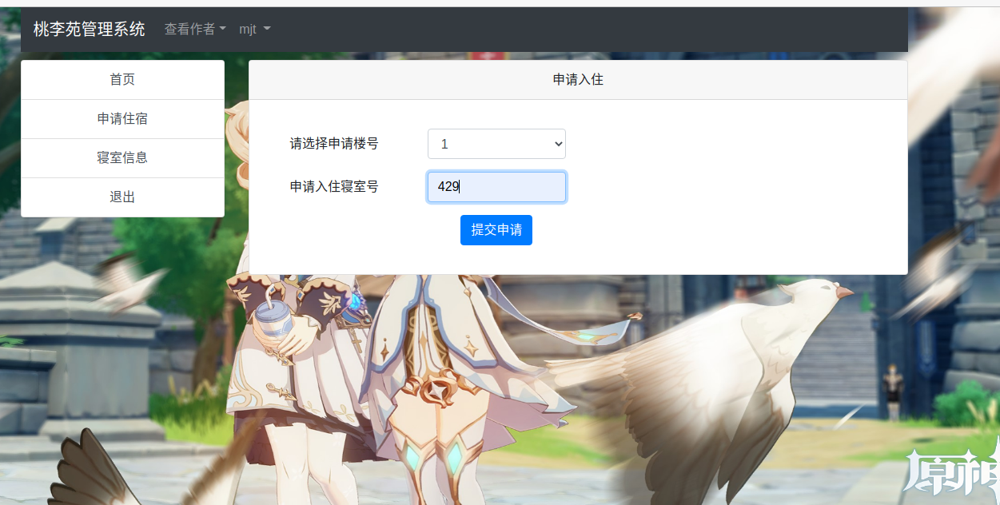
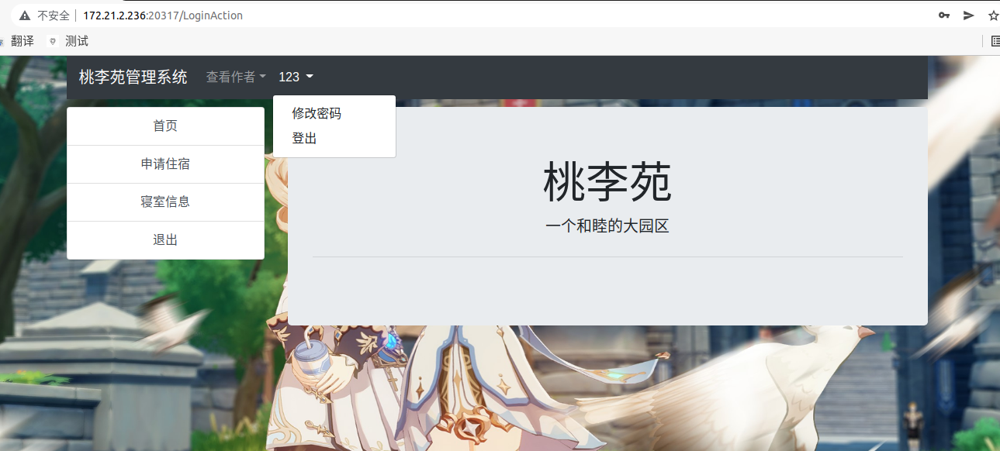

# 宿舍管理系统

## 一、项目设计

### 1.项目总体构成

#### 	这是一个学生宿舍管理系统，学生通过注册进入系统，然后申请宿舍进行入住，管理员只有一个admin，可以管理宿舍区的楼层，学生信息，处理学生的申请。

#### 

### 2.引入包说明

#### 	1）const express = require('express');  //前端框架

#### 	2）const Mongoose = require('./modules/mongoose.js'); //数据库操作封装

#### 	3）const bodyParser = require('body-parser')   //处理post提交的数据

#### 	4）const sd = require('silly-datetime');  //获取格式化日期

#### 	5）const session = require('express-session');  //保存用户信息

#### 	6）const ejs = require('ejs');  //渲染前端页面

### 3.项目文件结构：

#### 	1）modules：存放mongoose等对数据库操作的文件以及表的schema，查询修改方法。

#### 	2）node_modules:存放node的架包，其中添加了下载的bootstrap4.4.1样式包

#### 	3）public：存放图片等静态文件

#### 	4）views：存放前端页面。

#### 	5）app.js:主文件

二、使用说明书

#### 1.进入系统: 输入ip：172.21.2.236:20317   进行访问

#### 2.管理员登陆： 用户名密码均为“admin”进入

#### 3.管理员操作：

##### 	1）添加楼层：

每个楼号与楼名只能使用一次，重复添加就会提示该楼已存在，添加几个数据后查看楼层信息

#### 4.学生注册

#### 5.多注册几个数据，管理员查看

#### 6.学生申请住宿

重复提交申请会提示，已有提交记录，请勿重复提交

#### 7.管理员查看并处理申请：

处理后，楼层和学生的信息进行相应的更新

#### 8.学生查看寝室信息，未入住则没有信息

123用户的申请还未处理，故没有信息

#### 9.管理员注销用户，失效的用户无法登陆

333已注销：

#### 10.修改密码

点击导航栏上的用户名，会弹出下拉菜单，点击修改密码进入修改页面：

将用户123的密码改为321

修改完成后会提示重新登陆

重新输入用户名和新密码即可登陆

#### 11.登出（退出）

同样点击导航栏，选择登出，即可退出当前账户

## 三、开发日记

